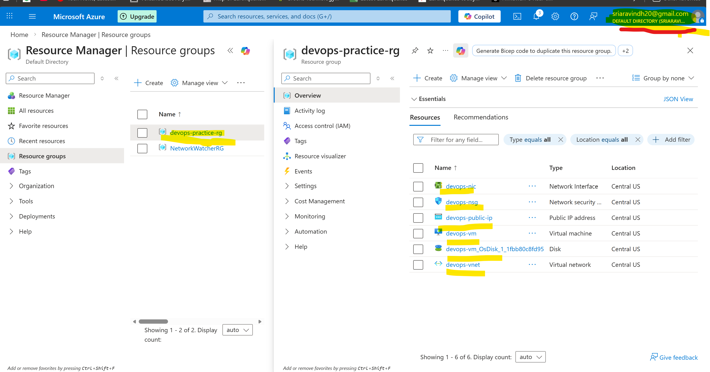
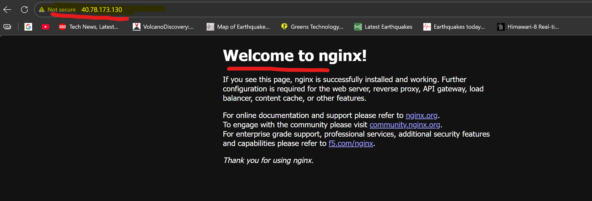

DevOps Lab

This repository is used for practicing:

- Git
- Docker
- Terraform
- Kubernetes
- Azure


This repository is used for practicing DevOps tools and workflows.


Day 1 :
                         Local Machine (WSL Ubuntu)
                        │
                        │
                Docker Practice (Day 1)
                        │
         ┌──────────────┴──────────────┐
         │                             │
   Docker Image Pull              Docker Container
        │                               │
        └──────────────► NGINX Web Server
                               │
                         Port Mapping
                               │
                       http://localhost

Day 2 :

                     Terraform (IaC)
                          │
                          │
                 Microsoft Azure Cloud
                          │
                  Resource Group
                          │
                     Virtual Network
                          │
                        Subnet
                          │
                  Network Security Group
                          │
                    Public IP Address
                          │
                     Network Interface
                          │
                    Linux Virtual Machine
                          │
                         Docker
                          │
                    NGINX Container
                          │
                   Public Web Server
                          │
               http://40.78.173.130


# DevOps Lab – Terraform Azure VM + Docker Nginx

This project demonstrates a simple DevOps workflow using Terraform, Azure, Docker, and GitHub.

## Project Overview

Infrastructure is provisioned using Terraform to create an Azure Virtual Machine.  
Docker is installed on the VM, and an Nginx container is deployed to serve a web page.

## Architecture

Local Machine (WSL Ubuntu)
        │
        │ Terraform
        ▼
Azure Resource Group
        │
        ▼
Azure Linux VM
        │
        ▼
Docker Installed
        │
        ▼
Nginx Container (Port 80)
        │
        ▼
Public Web Access

## Tools Used

- Terraform
- Microsoft Azure
- Docker
- Nginx
- Git & GitHub
- WSL Ubuntu

## Steps Performed

### 1. Setup Environment
- Installed WSL
- Installed Ubuntu
- Configured GitHub SSH

### 2. Docker Practice
- Pulled Nginx Docker image
- Ran container using port mapping
- Verified container using `docker ps`

### 3. Terraform Infrastructure
- Created Azure Resource Group
- Created Virtual Network
- Created Subnet
- Created Network Interface
- Created Linux Virtual Machine

### 4. Deploy Web Server
- Installed Docker on VM
- Pulled Nginx image
- Ran container:

```
sudo docker run -d -p 80:80 nginx
```

### 5. Verify Deployment
Access the server using the public IP:

```
http://<public-ip>
```

## Screenshots

### Azure Infrastructure


### Docker Container Running


### Nginx Webpage


## Repository Structure

```
devops-lab
│
├── main.tf
├── provider.tf
├── variables.tf
├── outputs.tf
├── .terraform.lock.hcl
├── screenshots
│   ├── azure-infrastructure.png
│   ├── docker-container-running.png
│   └── nginx-webpage.png
└── README.md
```

## Learning Outcome

- Infrastructure as Code using Terraform
- Azure VM provisioning
- Docker container deployment
- GitHub project documentation


Author: Aravindh

Learning DevOps with WSL and Ubuntu
